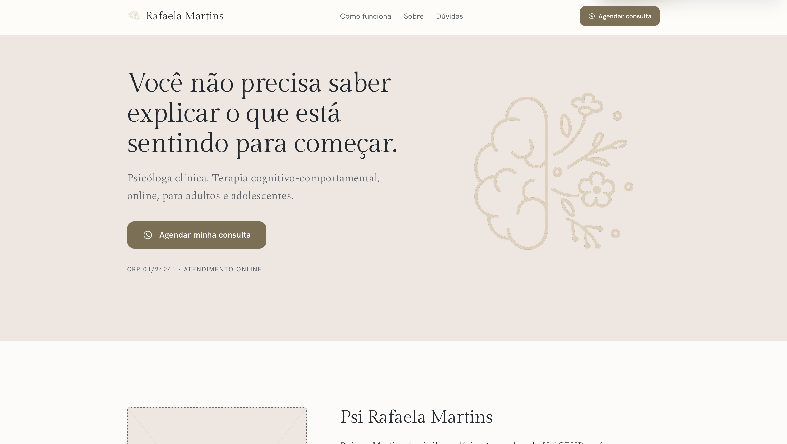
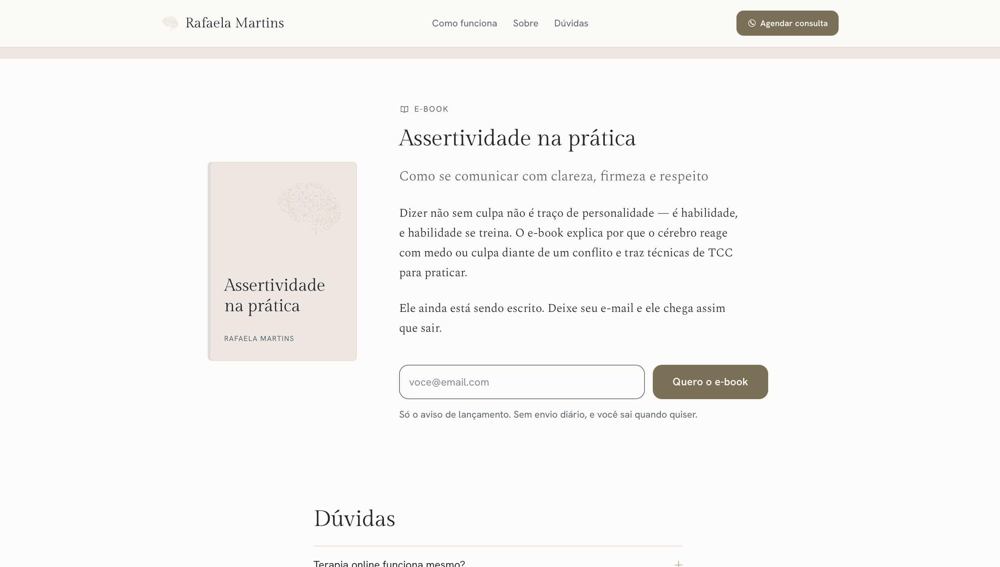
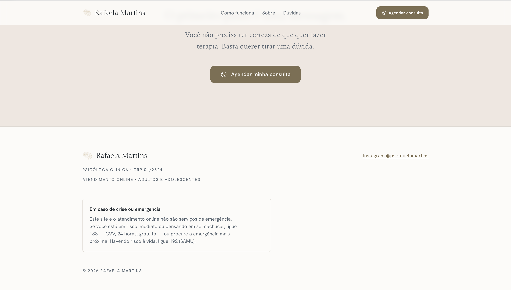

<p align="center">
  
</p>

<h1 align="center">rafa-psi-website</h1>

<p align="center">
  Landing page de captação para o consultório (online e presencial, Águas Claras, DF) da psicóloga Rafaela Martins.
</p>

Página única, estática, construída com [Astro](https://astro.build). O objetivo é um só: levar
quem chega — na maioria das vezes pelo [Instagram](https://www.instagram.com/psirafaelamartins/),
no celular — a **iniciar uma conversa no WhatsApp**. Sem framework de UI, sem runtime no cliente
além de um formulário de ~1,4 KB.

## Stack

- [Astro](https://astro.build) — geração estática, zero JS por padrão
- CSS puro, com tokens de design em [`src/styles/tokens.css`](src/styles/tokens.css)
- [Playwright](https://playwright.dev) — apenas para validação visual (light/dark, mobile/desktop)
- Gerenciador de pacotes: npm (`package-lock.json`)

> [!NOTE]
> Sem Tailwind, sem React/Vue/Svelte, sem CMS. O conteúdo inteiro vive em um único arquivo de
> dados, não espalhado pelos componentes — veja [Conteúdo e conformidade](#conteúdo-e-conformidade).

## Capturas de tela

<p align="center">
  
</p>

<p align="center">
  
  
</p>

## Como rodar

```bash
npm install
npm run dev       # http://localhost:4321
```

| Comando | O que faz |
|---|---|
| `npm run dev` | Servidor de desenvolvimento com hot reload |
| `npm run build` | Build estático de produção em `dist/` |
| `npm run preview` | Serve o conteúdo de `dist/` localmente |
| `npm run check` | Type-check do projeto (`@astrojs/check`) |

## Estrutura do projeto

```
src/
├── content/
│   └── site.ts          # Todo o texto e todos os fatos da página
├── components/           # Uma seção da página por componente (Astro)
├── layouts/
│   └── Base.astro        # <head>, fontes, tema claro/escuro
├── pages/
│   └── index.astro       # Composição da página, seção por seção
└── styles/
    ├── tokens.css         # Cor, tipografia e espaçamento — fechados no design
    └── global.css
docs/
├── business-vision.md    # Posicionamento, personas, jornada, guard-rails éticos
└── pendencias.md          # O que falta confirmar com a Rafaela e por quê
```

Cada seção visível da página (dobra, reconhecimento, como funciona, sobre, e-book, FAQ, CTA final)
é um componente Astro independente em [`src/components/`](src/components/), composto em
[`src/pages/index.astro`](src/pages/index.astro).

## Conteúdo e conformidade

Este projeto tem uma regra estrutural que vale a pena entender antes de editar qualquer coisa:

> [!IMPORTANT]
> Nenhum fato sobre a Rafaela é escrito direto em um componente. Todo texto e todo dado vivem em
> [`src/content/site.ts`](src/content/site.ts). O que ela ainda não confirmou entra marcado como
> `pendente(...)`, e a página **omite** o trecho ou usa um fallback explícito — nunca um valor
> plausível. Consulte [`docs/pendencias.md`](docs/pendencias.md) para o que falta e por quê.

A página também segue guard-rails éticos derivados do Código de Ética Profissional do Psicólogo
(Res. CFP 010/2005) e da Res. CFP 011/2018 — sem promessa de resultado, sem superlativo sobre a
profissional, sem preço ou apelo promocional, sem depoimento ou caso clínico. Detalhes completos em
[`docs/business-vision.md`](docs/business-vision.md), seção 9.

## Design

A direção visual está fechada e documentada em
[`src/styles/tokens.css`](src/styles/tokens.css): Gilda Display nos títulos, Spectral no corpo,
Hanken Grotesk na interface, com paleta em papel/linho/ardósia/ouro. Tema escuro é receita própria,
não inversão automática de cores.

> [!WARNING]
> Os valores de `tokens.css` não devem mudar sem revisar o artifact de referência linkado no topo
> do arquivo — a paleta e a escala tipográfica são decisões de design já fechadas, não pontos de
> ajuste livre.

## Validação antes de publicar

Antes de considerar qualquer mudança pronta:

1. `npm run build` sem erros.
2. Screenshot em 390px e 1440px, claro e escuro (quatro combinações) — regressão de tema é o erro
   mais comum aqui.
3. Conferir os guard-rails éticos no HTML gerado em `dist/`.
4. Com JavaScript desligado, a página continua legível e o FAQ continua abrindo (é `<details>`
   nativo, de propósito).
5. Foco de teclado visível e alvos de toque com pelo menos 44px.

`playwright` está como devDependency apenas para esta etapa.
